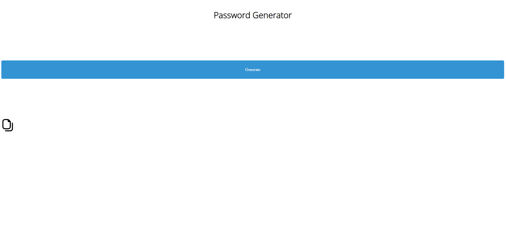

# Password generator
  It is a website written in JavaScript, CSS and HTML. Thanks to it, you can generate a password depending on the length you want.

# Image
* Copy: https://www.flaticon.com/free-icon-font/copy-alt_3914174?page=1&position=1&term=copy&origin=search&related_id=3914174

## Click bellow to test

# Works on
Has been tested on Firefox and Chrome
  
